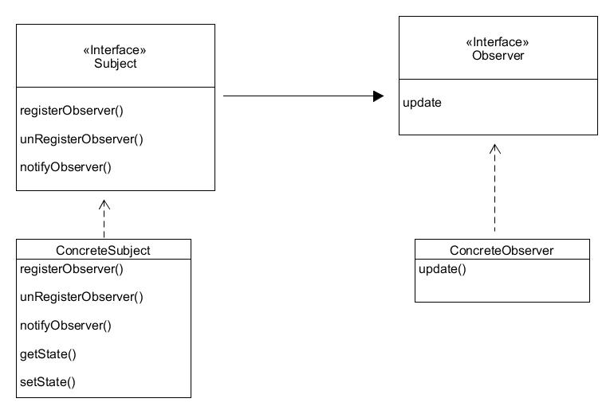

## 观察者

### 定义
> 观察者模式定义了对象之间的一对多依赖，当一个对象改变状态时，它的所有以来者都会接到通知并自动更新。

如：
主题和观察者定义一对多的关系。观察着依赖于主题，只要主题状态改变，观察者就会被通知。

### 理解

主题是真正拥有数据的人，观察者是主题的依赖者。

**松耦合**
当两个对象之间松耦合，交互而不用关心彼此实现的细节。
观察者模式提供一种对象设计，让主题和观察者之间松耦合。
对于观察者，主题只知道观察者实现某个接口（如Observer），主题不需要知道观察者的具体类是谁，以及实现细节；
当添加新的观察者时，**主题唯一依赖的是一个实现Observer接口的对象**，可以随时增加观察者。
当出现新的观察者时，主题代码不需要修改，只需要在新的观察者实现观察者接口，然后注册观察者即可，主题只会发通知给实现观察者接口的对象；
因为两者的松耦合性，可以**独立的复用主题或者观察者**。
> 改变主题或者观察者其中一方，并不会影响另一方。因为两者是松耦合的，只要接口被遵守，就可以随意地改变他们。
**为了交互对象之间的松耦合设计努力**

**松耦合的设计之所以能让我们建立一个弹性的OO系统，能应对变化是因为对象之间的相互依赖降到了最低。**

### 要点整理

- 观察者模式定义了对象之间的一对多关系
- 主题（可观察者）用一个共同的接口更新观察者
- 观察者和可观察者之间使用松耦合的方式结合，可观察者不知道观察者的细节，只知道观察者实现了观察者接口
- 获取数据是，可以使用推送或者主动拉去的方式，一般推送认为是正确的方式
